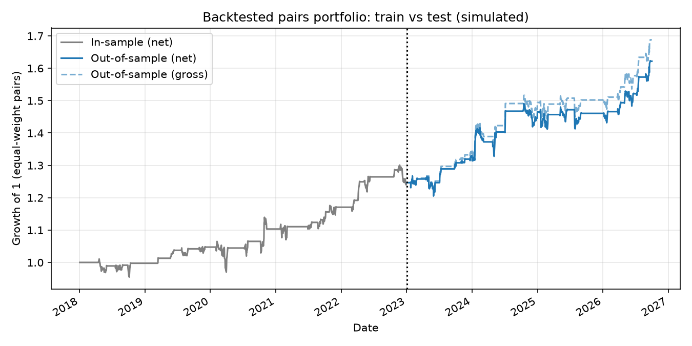
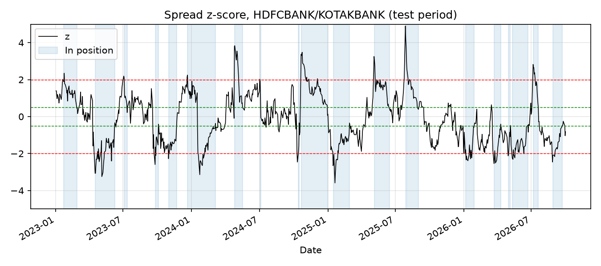

# Pairs Trading on NSE Banks: Cointegration + Z-score Backtest

A simulated (backtested) statistical-arbitrage strategy on Indian bank stocks: find cointegrated pairs on a training window, trade the spread on z-score signals on a held-out test window, and include transaction costs and slippage.

> **Backtested / simulated results only. Nothing here was traded live.**

## Problem
Can mean-reverting spreads between related NSE bank stocks be traded profitably out-of-sample after realistic costs, and how much of an apparent edge survives a strict train/test split?

## Method
- **Data:** daily adjusted closes via `yfinance` for 10 NSE banks (HDFCBANK, ICICIBANK, KOTAKBANK, AXISBANK, SBIN, INDUSINDBK, BANKBARODA, PNB, FEDERALBNK, IDFCFIRSTB), from 2018-01-01. Prices are cached in `data/prices.csv` for reproducibility.
- **Split:** train through 2022-12-31, test afterwards. Nothing from the test window is used to pick pairs or fit parameters.
- **Pair selection (train only):** Engle-Granger cointegration test on all 45 pairs, **Benjamini-Hochberg FDR correction** (10%) for multiple testing, positive hedge ratio, mean-reversion half-life between 2 and 60 days, and at most 5 pairs kept.
- **Spread:** `log(A) − β·log(B) − α`, with α and β from OLS on the training window and **frozen** for the test window.
- **Signal:** rolling 60-day z-score (past data only). Enter at |z| > 2, exit at |z| < 0.5, stop-loss and no re-entry beyond |z| > 4.
- **Execution:** signal at the close of day t, position held over day t+1 (one-day shift, no look-ahead). Equal capital per pair.
- **Costs:** 5 bps brokerage/taxes/fees + 5 bps slippage per side, on traded notional of both legs. A sensitivity table shows results from 0 to 40 bps.

## Results
Data: 2018-01-01 to 2026-10-01  | train ends 2022-12-30 | test 2023-01-02 to 2026-10-01
Pairs tested: 45  | selected after FDR + half-life filter: 1

Top 10 pairs by Engle-Granger p-value (train only):
| a | b | pvalue | p_adj | beta | half_life | selected |
|---|---|---|---|---|---|---|
| HDFCBANK | KOTAKBANK | 0.002 | 0.085 | 0.918 | 21.522 | True |
| HDFCBANK | ICICIBANK | 0.054 | 0.77 | 0.466 | 34.406 | False |
| AXISBANK | FEDERALBNK | 0.06 | 0.77 | 0.667 | 43.826 | False |
| INDUSINDBK | PNB | 0.068 | 0.77 | 0.766 | 55.337 | False |
| AXISBANK | SBIN | 0.088 | 0.791 | 0.514 | 45.162 | False |
| KOTAKBANK | SBIN | 0.108 | 0.803 | 0.404 | 59.065 | False |
| AXISBANK | IDFCFIRSTB | 0.125 | 0.803 | 0.645 | 48.801 | False |
| HDFCBANK | SBIN | 0.169 | 0.824 | 0.436 | 62.513 | False |
| ICICIBANK | KOTAKBANK | 0.173 | 0.824 | 1.725 | 44.675 | False |
| PNB | SBIN | 0.183 | 0.824 | -0.171 | 123.91 | False |

Portfolio metrics (costs: 10 bps per side incl. slippage):
| Period | Ann. return | Ann. vol | Sharpe | Max DD |
|---|---|---|---|---|
| In-sample (train), net | 4.7% | 7.0% | 0.68 | -8.9% |
| Out-of-sample (test), gross | 8.5% | 7.4% | 1.15 | -6.0% |
| Out-of-sample (test), net | 7.4% | 7.4% | 1.00 | -6.2% |

Per-pair out-of-sample results:
| Pair | Trades | Net Sharpe (test) | Net total return |
|---|---|---|---|
| HDFCBANK/KOTAKBANK | 20 | 1.00 | 30.1% |

Out-of-sample sensitivity to transaction costs:
| Cost per side (bps) | Ann. return | Sharpe |
|---|---|---|
| 0 | 8.5% | 1.15 |
| 5 | 8.0% | 1.07 |
| 10 | 7.4% | 1.00 |
| 20 | 6.3% | 0.85 |
| 40 | 4.2% | 0.55 |




One pair (HDFCBANK/KOTAKBANK) passed selection at a 10% FDR. Out-of-sample net Sharpe was 1.00 over ~3.75 years (20 trades), versus 0.68 in-sample. With a single pair and a short window, the Sharpe estimate has wide uncertainty (roughly ±0.6), and the test period includes the HDFC merger, so this is evidence of a modest, plausible mean-reversion effect and not proof of a robust edge. Net Sharpe fell to 0.55 at 40 bps per side, so the result is cost-sensitive.

## Limitations
- **Shorting:** Indian cash equities cannot be held short overnight. The backtest assumes the short leg is done via single-stock futures but ignores margin, lot sizes, rollover and futures basis. Returns are on gross notional, not on margin.
- **Execution:** assumes fills at the close on the signal day, plus flat slippage. Real fills, liquidity and impact will differ. Cost levels should be checked against current broker, exchange and tax rates.
- **Survivorship and universe bias:** the universe is today's well-known banks, chosen with hindsight. Corporate actions (e.g. the HDFC merger in 2023) can distort price relationships; adjusted prices from Yahoo are not guaranteed to be clean.
- **Small sample:** a few pairs and a few years. Cointegration relationships break, and a good test period can be luck.
- **Statistical:** Engle-Granger is tested in one direction only; hedge ratios are static; the z-score window and thresholds were set a priori and not tuned, but any further tuning on the test window would invalidate the out-of-sample claim.

## Run it
```bash
pip install -r requirements.txt
python run_backtest.py            # downloads data (first run), prints tables, writes results.md and figures/
python run_backtest.py --refresh  # re-download prices
pytest                            # tests (run on synthetic data with a planted cointegrated pair)
```
Files: `pairs.py` (selection, signals, backtest, metrics), `run_backtest.py` (data and report), `tests/`.
